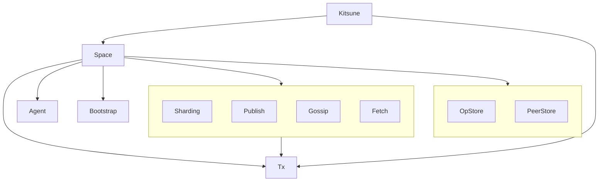

### Kitsune Abstract Modules

- Kitsune - Glue pulling the other module types together.
- Space - DHT boundary.
- Agent - Agent metadata, cryptography, and join/leaves status.
- Bootstrap - WAN discovery.
- Sharding - Network logic for determination of current arc.
- Publish - Network logic for quickly sending out notices of new op hashes, and ensuring they remain out there.
- Gossip - Network logic for reliable eventual notification of op hash existence.
- Fetch - Network logic for fetching the op data associated with claimed op hashes.
- OpStore - Store and query ops.
- PeerStore - Store and query peers.
- Tx - Underlying network transport connectivity and banning of bad actors.
